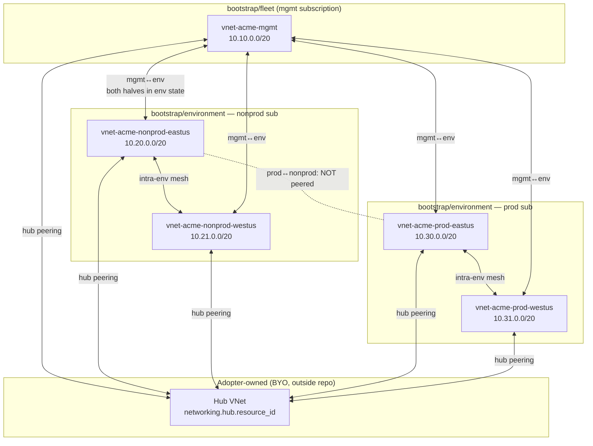
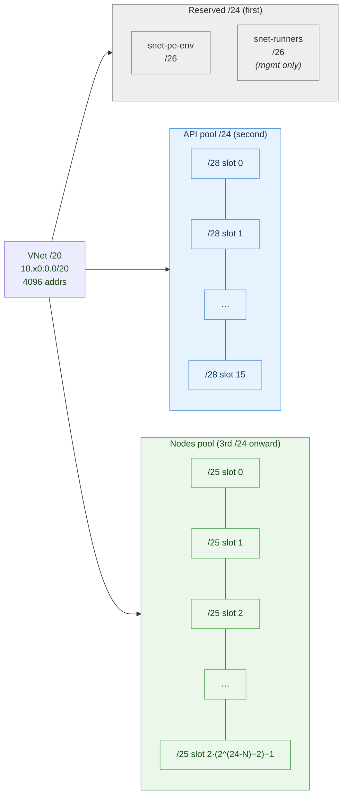
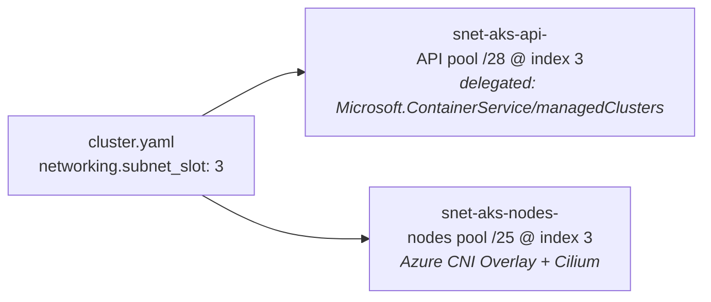
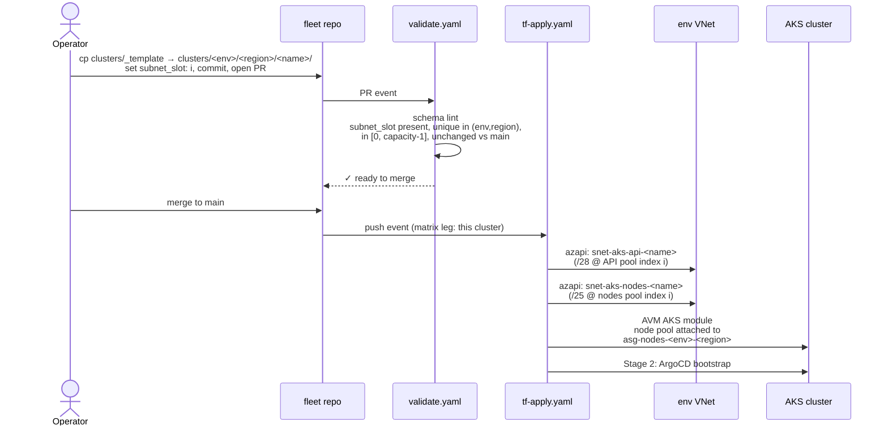
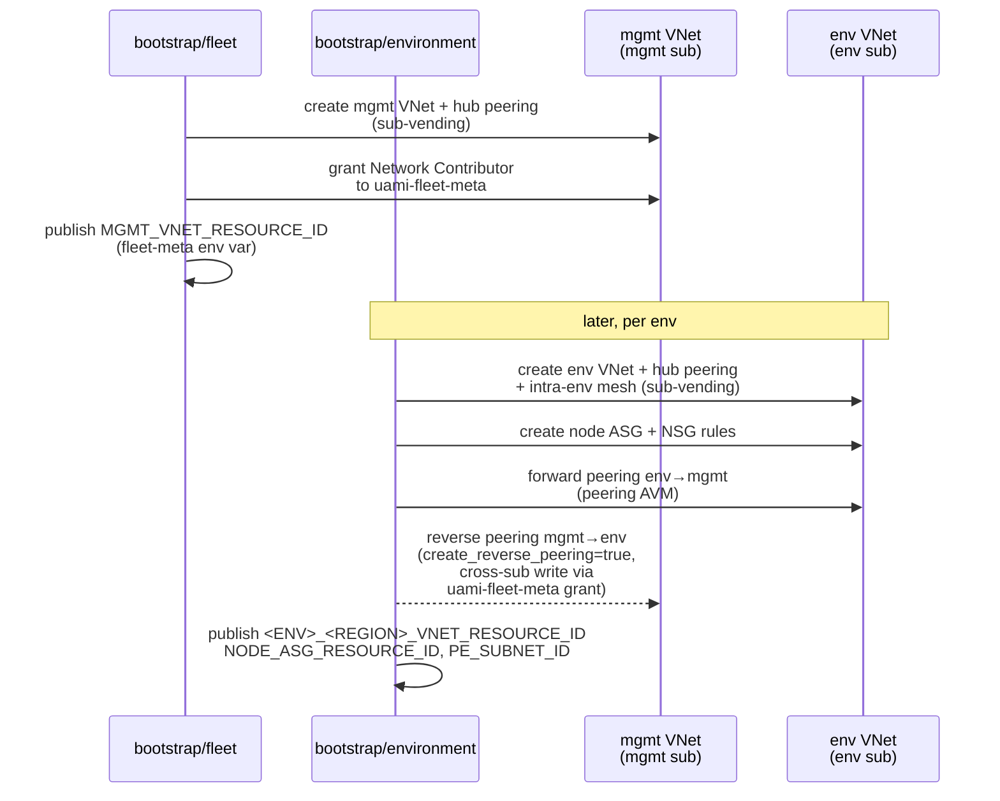

# Networking design

Operational reference for the fleet's VNet, peering, and subnet layout.
PLAN §3.4 is the authoritative spec; this file is the human-readable
companion covering design rationale, CIDR math, and the single
per-cluster knob operators set.

Implementation lives in:

- `terraform/bootstrap/fleet/main.network.tf` — mgmt VNet (N=1)
- `terraform/bootstrap/environment/main.network.tf` — env VNets +
  per-env-region node ASG + NSG rules
- `terraform/bootstrap/environment/main.peering.tf` — mgmt↔env peerings
  (both halves in env state via peering AVM + `create_reverse_peering`)
- `terraform/stages/1-cluster/` — per-cluster `/28` api + `/25` nodes
  subnets (azapi children of the env VNet) + AKS ASG attachment
- `terraform/modules/fleet-identity/` — fleet + env-scope derivations
- `terraform/config-loader/load.sh` — cluster-scope derivations

Parity contract: `docs/naming.md`, `config-loader/load.sh`, and the
HCL in `modules/fleet-identity/` must agree on every name and CIDR
formula. Touch one, touch all three.

## Tiers

| Tier | VNet                                   | Owner                    | Peerings                                            |
| ---- | -------------------------------------- | ------------------------ | --------------------------------------------------- |
| Hub  | adopter-owned, BYO                     | adopter (outside repo)   | every mgmt and env VNet peers to it                 |
| Mgmt | `vnet-<fleet.name>-mgmt` (1, regional) | `bootstrap/fleet`        | ↔ hub; ↔ each env VNet (reverse half lives in env)  |
| Env  | `vnet-<fleet.name>-<env>-<region>`     | `bootstrap/environment`  | ↔ hub; full mesh intra-env; ↔ mgmt                  |



- One VNet per env-per-region. Adding a second region under an env is
  a PR-visible edit to `_fleet.yaml.networking.envs.<env>.regions.<r>`
  followed by `env-bootstrap.yaml` for that env.
- **Prod↔nonprod are intentionally not peered.** The sub-vending
  module's `mesh_peering_enabled` is scoped to a single invocation;
  `bootstrap/environment` runs once per env, so prod and nonprod
  never appear in the same mesh call.

## Modules

All referenced by registry, not vendored. Pessimistic-minor pinned,
`enable_telemetry = false`.

- `Azure/avm-ptn-alz-sub-vending/azure ~> 0.2` — creates VNets. Used
  with `subscription_alias_enabled = false` so the fleet targets
  already-bootstrapped subscriptions. In `bootstrap/fleet` N=1 (mgmt).
  In `bootstrap/environment` N=count of regions for that env, with
  `mesh_peering_enabled = true` and per-VNet `hub_peering_enabled =
  true`. Requires `azapi ~> 2.5`, `modtm ~> 0.3`, `random ~> 3.5`.
- `Azure/avm-res-network-virtualnetwork/azurerm//modules/peering ~> 0.17`
  — mgmt↔env peering pair. Azapi-only (`azapi ~> 2.0`) despite the
  parent `azurerm` module. Called with `create_reverse_peering = true`
  so both halves land in a single state file; atomic destroy if an
  env VNet is retired.

## CIDR layout — two-pool design

Each cluster needs two subnets of very different sizes:

- `snet-aks-api-<cluster>` — **exactly `/28`**. AKS API-server VNet
  integration requires `/28`, delegated to
  `Microsoft.ContainerService/managedClusters`, empty, unshared.
- `snet-aks-nodes-<cluster>` — `/25`. Sized for Azure CNI **Overlay**
  with Cilium, where pod IPs come from `networking.pod_cidr` (a
  separate non-routable space per cluster) and never consume node
  subnet addresses. `/25` = 128 addrs covers nodes + ILBs.

A naive `/24`-per-cluster symmetric split into two `/25`s wastes 112
addresses on the api side (the `/28` is delegated; nothing else can
live there). The fleet instead carves each env-region VNet into two
disjoint pools:

```
10.x0.0.0/20      VNet address_space
│
├── 10.x0.0.0/24     reserved zone (first /24)
│   ├── 10.x0.0.0/26    snet-pe-{shared|env}  (PE subnet)
│   └── 10.x0.0.64/26   snet-runners          (mgmt VNet only; ACA-delegated)
│
├── 10.x0.1.0/24     API pool → 16 × /28
│   ├── 10.x0.1.0/28    snet-aks-api-<cluster 0>
│   ├── 10.x0.1.16/28   snet-aks-api-<cluster 1>
│   ├── ...
│   └── 10.x0.1.240/28  snet-aks-api-<cluster 15>
│
└── 10.x0.2.0/21     NODES pool → 2 × /25 per /24 in the pool
    ├── 10.x0.2.0/25    snet-aks-nodes-<cluster 0>
    ├── 10.x0.2.128/25  snet-aks-nodes-<cluster 1>
    ├── 10.x0.3.0/25    snet-aks-nodes-<cluster 2>
    ├── 10.x0.3.128/25  snet-aks-nodes-<cluster 3>
    └── ...             (13 × /24 = 26 /25 slots available)
```



For a cluster with `subnet_slot: i`, **both** `snet-aks-api-<name>`
(API pool `/28` at index `i`) and `snet-aks-nodes-<name>` (nodes pool
`/25` at index `i`) are derived from the same `i` — one index per
cluster.



`subnet_slot: i` is the single per-cluster index consumed by both
pools. API subnet and nodes subnet for a given cluster always share
the same index — operators reason about "cluster 3" not "cluster 3
api + cluster 5 nodes."

### Derivation

Given env VNet address_space `A = <ip>/N`:

```
reserved   = cidrsubnet(A, 24-N, 0)   # first /24, PE/runners live here
api_pool   = cidrsubnet(A, 24-N, 1)   # second /24, 16 × /28

snet_aks_api(i)   = cidrsubnet(api_pool, 4, i)                # i ∈ [0, 16)
snet_aks_nodes(i) = let base = cidrsubnet(A, 24-N, 2 + (i/2))
                    in  cidrsubnet(base, 1, i % 2)
```

Reference implementations:

- Python (`config-loader/load.sh`): `ipaddress.ip_network(A).subnets(new_prefix=24)`
  indexed at `1` (api pool), `2 + (i // 2)` (nodes `/24`), then
  `.subnets(new_prefix=28)[i]` / `.subnets(new_prefix=25)[i % 2]`.
- HCL (`fleet-identity`, `bootstrap/environment`, Stage 1): `cidrsubnet()`
  nested as above. Note that `terraform validate` does **not**
  evaluate `cidrsubnet()` — shape bugs in inputs are latent until
  plan/apply.

### Capacity

```
capacity = min(16, 2 * (2^(24-N) - 2))
```

| VNet `/N` | `2^(24-N) - 2` nodes /24s | `2 × …` /25 slots | `capacity` (api-bound at 16) |
| --------- | ------------------------- | ----------------- | ---------------------------- |
| `/20`     | 13                        | 26                | **16**                       |
| `/19`     | 29                        | 58                | **16**                       |
| `/21`     | 5                         | 10                | **10**                       |
| `/22`     | 1                         | 2                 | **2**                        |

At `/20` and wider, the api pool is the hard cap — a `/24` holds
exactly 16 `/28`s, and widening the VNet does not raise capacity.
Operators hitting 16 clusters per env-region either:

1. Add a second region under the env (preferred — PR edit to
   `_fleet.yaml.networking.envs.<env>.regions.<new-region>`), or
2. Open a PR that changes the pool shape in PLAN §3.4 /
   `docs/naming.md` / `config-loader/load.sh` / `fleet-identity`
   together (e.g. shrink nodes subnets to `/26` to free a second
   api pool from the first nodes `/24`).

## `subnet_slot` contract

Every `cluster.yaml` carries a **required** `networking.subnet_slot: <int>`.
No default. The PR-check in `.github/workflows/validate.yaml` enforces:

1. Present on every `cluster.yaml`.
2. Integer in `[0, capacity-1]` against the env-region VNet's
   `address_space`.
3. Unique across all clusters sharing `(env, region)`.
4. **Immutable once set.** Changing `subnet_slot` in-place re-plans
   subnet replacement, which forces AKS cluster destroy/recreate.
   The PR-check diffs `cluster.yaml` against `main` and blocks
   mutations.

Operators pick slots at cluster-creation time. The scaffolded
`clusters/_template/cluster.yaml` ships `subnet_slot: 0` with a
comment pointing at PLAN §3.4.

## Single-PR new-cluster flow

1. Operator `cp -r clusters/_template clusters/<env>/<region>/<name>/`
   and edits `cluster.yaml` (including `subnet_slot`).
2. Opens PR → `validate.yaml` runs schema lint + the `subnet_slot`
   checks above.
3. On merge, `tf-apply.yaml` runs Stage 1 (creates the `/28` api
   subnet in the API pool and the `/25` nodes subnet in the nodes
   pool via azapi children of the env VNet, attaches the AKS node
   pool to the env-region node ASG, creates the AKS cluster) and
   Stage 2 (ArgoCD bootstrap) in one matrix leg. No re-run of
   `bootstrap/environment` is required.



## Peering ownership

| Peering                       | Owner (state)           | Mechanism                                                                        |
| ----------------------------- | ----------------------- | -------------------------------------------------------------------------------- |
| mgmt ↔ hub                    | `bootstrap/fleet`       | sub-vending `hub_peering_enabled = true` on the mgmt VNet                        |
| env-region ↔ hub              | `bootstrap/environment` | sub-vending per-VNet `hub_peering_enabled = true`                                |
| env-region ↔ env-region (mesh)| `bootstrap/environment` | sub-vending `mesh_peering_enabled = true` within the env invocation              |
| mgmt ↔ env-region (both sides)| `bootstrap/environment` | peering AVM submodule, `create_reverse_peering = true`, one call per env-region  |



The reverse half of every mgmt↔env peering writes **across
subscriptions** (from env sub into the mgmt VNet's sub) using the
`Network Contributor` grant `bootstrap/fleet` issues to
`uami-fleet-meta` scoped to the mgmt VNet resource id. Without that
grant the reverse peering plan is rejected at apply time.

### Peering names

| Direction     | Name pattern                       |
| ------------- | ---------------------------------- |
| env → mgmt    | `peer-<env>-<region>-to-mgmt`      |
| mgmt → env    | `peer-mgmt-to-<env>-<region>`      |
| env ↔ env     | emitted by sub-vending mesh (per-module naming) |
| any ↔ hub     | emitted by sub-vending hub-peering helper        |

## Per-cluster private DNS zone links

Derived, not BYO. Every cluster's private DNS zone gets two
`virtualNetworkLinks`:

- env VNet id (from the env-scope repo variable `<ENV>_<REGION>_VNET_RESOURCE_ID`)
- mgmt VNet id (from the fleet-scope repo variable `MGMT_VNET_RESOURCE_ID`)

Both are published by the bootstrap stages that own the VNets and
consumed by Stage 1 when it creates the per-cluster `privateDnsZones` +
`virtualNetworkLinks` resources.

## Application Security Groups for AKS nodes

- One ASG per env-region: `asg-nodes-<env>-<region>`. Owned by
  `bootstrap/environment` as an `azapi_resource` (no AVM wrapper).
- Acts as the symbolic source group for NSG rules on
  `nsg-pe-env-<env>-<region>`. Example: the sub-vending NSG schema
  does not expose `sourceApplicationSecurityGroups`, so the
  "inbound 443 from nodes → `snet-pe-env`" rule is authored
  out-of-band as `azapi_resource.nsg_pe_env_rule_443` (child of the
  module-owned NSG).
- **Stage 1 attaches each AKS cluster's node pool** to the env-region
  ASG via `networkProfile.applicationSecurityGroups = [<asg-id>]` on
  the AVM AKS module's agent-pool input. The pinned AKS API version
  exposing this field on agent pools is confirmed at implementation
  time (see PLAN §3.4 fallback note and `_TASK.md`).

**Fallback** if the pinned AKS API does not support agent-pool ASG
attachment: Stage 1 writes per-cluster NSG rules into
`nsg-pe-env-<env>-<region>` directly. `bootstrap/environment`
pre-grants the `uami-fleet-<env>` identity `Network Contributor`
scoped to that NSG so the cross-stage write succeeds.

## Repo variables (cross-stage wiring)

| Variable                                  | Published by            | Consumed by                                                      |
| ----------------------------------------- | ----------------------- | ---------------------------------------------------------------- |
| `MGMT_VNET_RESOURCE_ID`                   | `bootstrap/fleet`       | Stage 1 (private DNS zone VNet link); env observability wiring   |
| `<ENV>_<REGION>_VNET_RESOURCE_ID`         | `bootstrap/environment` | Stage 1 (per-cluster subnets parent; DNS zone link)              |
| `<ENV>_<REGION>_NODE_ASG_RESOURCE_ID`     | `bootstrap/environment` | Stage 1 (AKS node-pool ASG attachment, or NSG rule author)       |
| `<ENV>_<REGION>_PE_SUBNET_ID`             | `bootstrap/environment` | Env observability (Grafana PE), ad-hoc env-scope PEs             |

Each is written onto the corresponding GitHub Environment by the
stage that owns it — no Stage 0 passthrough.

## CNI / dataplane assumptions

The fleet assumes **Azure CNI Overlay + Cilium** on every AKS cluster:

- Pod IPs come from a deterministic per-cluster `/16` in CGNAT
  (`100.64.0.0/10`) — see "Pod CIDR allocation" below — not from
  `cluster.networking.pod_cidr` in `_defaults.yaml` (the legacy key
  is ignored by Stage 1 and will be removed in a cleanup commit).
- Nodes subnet only holds nodes + internal load balancers → `/25` is
  comfortably sized for realistic node counts.
- Services CIDR is currently hard-coded to `10.0.0.0/16` inside
  `modules/aks-cluster` (cluster-local, non-routable). Overridable
  later if a conflict appears.

If the fleet ever moves off CNI Overlay, the nodes subnet sizing
needs to be re-derived against `nodes × (1 + max_pods)`; this is a
PLAN §3.4 amendment plus changes in the three parity files.

## Pod CIDR allocation (CGNAT)

Pod IPs live in `100.64.0.0/10` (RFC 6598 CGNAT), completely disjoint
from the VNet address plan. Allocation is two-dimensional:

- **`pod_cidr_slot`** — integer `[0, 15]`, declared per env-region in
  `_fleet.yaml.networking.envs.<env>.regions.<region>.pod_cidr_slot`.
  Unique across the entire fleet; immutable once set. Reserves a
  `/12` envelope at `100.[64 + pod_cidr_slot*16].0.0/12`.
- **`subnet_slot`** — the per-cluster integer already declared in
  `cluster.yaml.networking.subnet_slot`. The same slot indexes the
  cluster's subnets *and* its pod CIDR.

Per-cluster pod CIDR:

```
pod_cidr = 100.[64 + pod_cidr_slot*16 + subnet_slot].0.0/16
```

Worked examples (from `.github/fixtures/adopter-test.tfvars`):

| env / region       | pod_cidr_slot | subnet_slot | pod_cidr             |
| ------------------ | ------------- | ----------- | -------------------- |
| mgmt / eastus      | 0             | 0           | `100.64.0.0/16`      |
| nonprod / eastus   | 1             | 0           | `100.80.0.0/16`      |
| nonprod / eastus   | 1             | 3           | `100.83.0.0/16`      |
| prod / eastus      | 2             | 0           | `100.96.0.0/16`      |

Capacity: 16 env-regions × 16 clusters × `/16` each (65 536 pod IPs
per cluster → 262 nodes at the default `max_pods=250`). Operators
hitting the 16-env-region cap add a second CGNAT pool by design
change (PLAN §3.4 update required).

Pod CIDRs are never routed outside the node (Overlay CNI encapsulates
pod-to-pod traffic); no peering, UDR, or firewall configuration
depends on them. The `pod_cidr_slot` × `subnet_slot` grid exists
purely to keep debugging output (`kubectl get pods -o wide`) readable
across clusters — prod vs nonprod pod IPs never overlap.

## Pre-Phase-B (legacy) note

Before PLAN §3.4 landed, `cluster.yaml.networking` carried
`vnet_id`, `subnet_name`, and `dns_linked_vnet_ids` as operator-set
fields, with subnets pre-existing in adopter-owned VNets. Those
fields are gone. Every VNet and subnet in the fleet is now repo-owned
and derived from `_fleet.yaml.networking.*` + `subnet_slot`. Silence-
on-absence guards (`try(..., null)`) in `fleet-identity` preserve
behaviour when partial `_fleet.yaml` renders are present during
migration, but downstream callsites precondition non-null before use.
