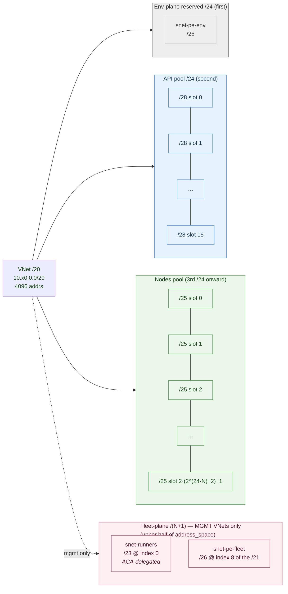
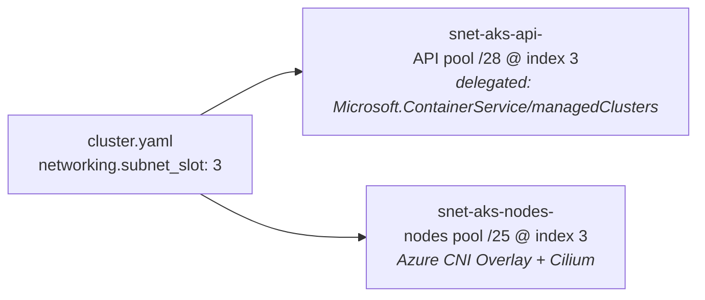
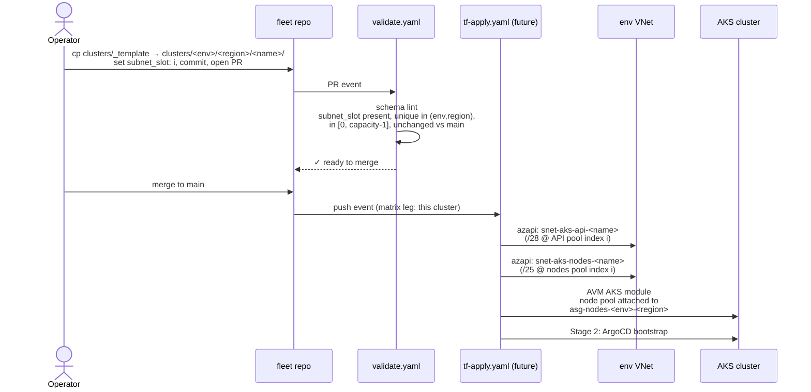

# Networking design

Operational reference for the fleet's VNet, peering, and subnet layout.
PLAN §3.4 is the authoritative spec; this file is the human-readable
companion covering design rationale, CIDR math, and the single
per-cluster knob operators set.

Implementation lives in:

- `terraform/bootstrap/fleet/main.network.tf` — mgmt VNets (one per
  mgmt region; owns only the mgmt-only fleet-plane subnets
  `snet-pe-fleet` + `snet-runners` plus the hub peering on each mgmt
  VNet) and the mgmt↔hub peering.
- `terraform/bootstrap/environment/main.network.tf` — env VNets (incl.
  the mgmt VNet's env-plane subnet `snet-pe-env`), per-env-region node
  ASG, route table shell, NSG rules.
- `terraform/bootstrap/environment/main.peering.tf` — env↔mgmt peerings
  for every non-mgmt env-region (both halves in env state via peering
  AVM + `create_reverse_peering`).
- `terraform/stages/1-cluster/` — per-cluster `/28` api + `/25` nodes
  subnets (azapi children of the env VNet) + AKS ASG attachment + the
  per-cluster private DNS zone with `virtualNetworkLinks`.
- `terraform/modules/fleet-identity/` — fleet + env-scope derivations
  (canonical naming + CIDR formulas).
- `terraform/config-loader/load.sh` — cluster-scope derivations.

Parity contract: `docs/naming.md`, `config-loader/load.sh`, and the
HCL in `modules/fleet-identity/` must agree on every name and CIDR
formula. Touch one, touch all three.

## Tiers

| Tier | VNet                                   | Owner                                                | Peerings                                            |
| ---- | -------------------------------------- | ---------------------------------------------------- | --------------------------------------------------- |
| Hub  | adopter-owned, BYO                     | adopter (outside repo)                               | per-env-region opt-in via `hub_network_resource_id` |
| Mgmt | `vnet-<fleet.name>-mgmt-<region>`      | `bootstrap/environment` (VNet shell + `snet-pe-env`); `bootstrap/fleet` (mgmt-only `snet-pe-fleet` + `snet-runners` + hub peering) | ↔ hub (if set); ↔ each non-mgmt env VNet (reverse half lives in env state) |
| Env  | `vnet-<fleet.name>-<env>-<region>`     | `bootstrap/environment`                              | ↔ hub (if set); full mesh intra-env; ↔ mgmt         |

The mgmt VNet and any other env VNet share **exactly the same name
derivation** — `vnet-<fleet.name>-<env>-<region>`. There is no
mgmt-specific carve-out. What makes mgmt special is the two
**mgmt-only** subnets (`snet-pe-fleet`, `snet-runners`) carved out of
the upper `/(N+1)` of the mgmt VNet's address space by
`bootstrap/fleet`; every env-region (incl. mgmt) additionally carries
`snet-pe-env` in the first `/26`, authored by `bootstrap/environment`.

```mermaid
flowchart TB
    subgraph ADOPTER["Adopter-owned (BYO, outside repo)"]
        HUB["Hub VNet<br/>(nullable: envs.&lt;env&gt;.regions.&lt;region&gt;.<br/>hub_network_resource_id)"]
    end

    subgraph FLEET["bootstrap/fleet (owns fleet-plane zone + hub peering per mgmt region)"]
        MGMT["vnet-acme-mgmt-eastus<br/>10.10.0.0/20"]
    end

    subgraph NONPROD["bootstrap/environment — nonprod sub"]
        NPE["vnet-acme-nonprod-eastus<br/>10.20.0.0/20"]
        NPW["vnet-acme-nonprod-westus<br/>10.21.0.0/20"]
    end

    subgraph PROD["bootstrap/environment — prod sub"]
        PE["vnet-acme-prod-eastus<br/>10.30.0.0/20"]
        PW["vnet-acme-prod-westus<br/>10.31.0.0/20"]
    end

    MGMT <-->|hub peering<br/>(if set)| HUB
    NPE  <-->|hub peering<br/>(if set)| HUB
    NPW  <-->|hub peering<br/>(if set)| HUB
    PE   <-->|hub peering<br/>(if set)| HUB
    PW   <-->|hub peering<br/>(if set)| HUB

    NPE <-->|intra-env mesh| NPW
    PE  <-->|intra-env mesh| PW

    MGMT <-->|mgmt↔env<br/>both halves in env state| NPE
    MGMT <-->|mgmt↔env| NPW
    MGMT <-->|mgmt↔env| PE
    MGMT <-->|mgmt↔env| PW

    NPE -. "prod↔nonprod: NOT peered" .- PE
```

- One VNet per env-per-region (incl. one per mgmt region). Adding a
  second region under an env is a PR-visible edit to
  `_fleet.yaml.networking.envs.<env>.regions.<r>` followed by `env-bootstrap.yaml`
  for that env. Adding a second **mgmt** region additionally re-runs
  `bootstrap/fleet` to place `snet-pe-fleet` + `snet-runners` in the
  new mgmt VNet.
- **Hub peering is per-env-region and opt-in.** Each entry under
  `envs.<env>.regions.<region>.hub_network_resource_id` is nullable
  (including on mgmt); null ⇒ no hub peering for that env-region
  (adopter-managed routing).
- **Prod↔nonprod are intentionally not peered.** The sub-vending
  module's `mesh_peering_enabled` is scoped to a single invocation;
  `bootstrap/environment` runs once per env, so prod and nonprod
  never appear in the same mesh call.

## Modules

All referenced by registry, not vendored. Pessimistic-minor pinned,
`enable_telemetry = false`.

- `Azure/avm-ptn-alz-sub-vending/azure ~> 0.2` — creates VNets. Used
  with `subscription_alias_enabled = false` so the fleet targets
  already-bootstrapped subscriptions. `bootstrap/fleet` calls it once
  per mgmt region to author the mgmt VNet shell + the mgmt-only
  fleet-plane subnets (`snet-pe-fleet`, `snet-runners`) + the per-VNet
  hub peering (gated on `hub_network_resource_id`).
  `bootstrap/environment` for `env != "mgmt"` calls it with N = count
  of regions for that env and `mesh_peering_enabled = true` (per-VNet
  `hub_peering_enabled` gated on each region's
  `hub_network_resource_id`). For `env == "mgmt"` it skips sub-vending
  entirely — the mgmt VNets already exist — and authors the env-plane
  subnets (`snet-pe-env`, api pool, nodes pool) as azapi children of
  the pre-existing mgmt VNets referenced by `var.mgmt_vnet_resource_ids`.
  Declares `azapi ~> 2.9`, `modtm ~> 0.3`, `random ~> 3.8` at the
  callsite (the sub-vending module's own `required_providers` uses
  lower floors — `random ~> 3.5` etc. — which `~> 3.8` satisfies).
- `Azure/avm-res-network-virtualnetwork/azurerm//modules/peering ~> 0.17`
  — mgmt↔env peering pair. Azapi-only (`azapi ~> 2.0`) despite the
  parent `azurerm` module. Called with `create_reverse_peering = true`
  so both halves land in a single state file; atomic destroy if an
  env VNet is retired. Skipped entirely for env=mgmt (mgmt VNets don't
  peer to themselves — their only cross-VNet peerings are the hub
  peering emitted by `bootstrap/fleet` and the reverse halves authored
  by other envs).

## CIDR layout — two-pool design

Each cluster needs two subnets of very different sizes:

- `snet-aks-api-<cluster>` — **exactly `/28`**. AKS API-server VNet
  integration requires `/28`, delegated to
  `Microsoft.ContainerService/managedClusters`, empty, unshared.
- `snet-aks-nodes-<cluster>` — `/25`. Sized for Azure CNI **Overlay**
  with Cilium, where pod IPs come from a fleet-wide shared CGNAT
  pod CIDR (`100.64.0.0/16`, hard-coded in `modules/aks-cluster`) —
  **not** from the node subnet, so this `/25` only has to cover
  nodes + ILBs. Pod IPs never leak onto the VNet because overlay
  performs SNAT at the node; safe to share the same space across
  every cluster in the fleet. `/25` = 128 addrs covers both
  comfortably. See *Shared pod CIDR (CGNAT)* below.

A naive `/24`-per-cluster symmetric split into two `/25`s wastes 112
addresses on the api side (the `/28` is delegated; nothing else can
live there). The fleet instead carves each env-region VNet into two
disjoint pools:

```
10.x0.0.0/20      VNet address_space
│
├── 10.x0.0.0/24     env-plane reserved zone (first /24)
│   └── 10.x0.0.0/26    snet-pe-env               (PE subnet; every env-region)
│
├── 10.x0.1.0/24     API pool → 16 × /28
│   ├── 10.x0.1.0/28    snet-aks-api-<cluster 0>
│   ├── 10.x0.1.16/28   snet-aks-api-<cluster 1>
│   ├── ...
│   └── 10.x0.1.240/28  snet-aks-api-<cluster 15>
│
├── 10.x0.2.0/21     NODES pool → 2 × /25 per /24 in the pool
│   ├── 10.x0.2.0/25    snet-aks-nodes-<cluster 0>
│   ├── 10.x0.2.128/25  snet-aks-nodes-<cluster 1>
│   ├── 10.x0.3.0/25    snet-aks-nodes-<cluster 2>
│   ├── 10.x0.3.128/25  snet-aks-nodes-<cluster 3>
│   └── ...             (13 × /24 = 26 /25 slots available)
│
└── 10.x0.8.0/21     fleet-plane reserved zone — MGMT VNETS ONLY
                     (upper /(N+1) of the VNet = /21 for N=20)
    ├── 10.x0.8.0/23    snet-runners     (/23 @ index 0; ACA-delegated)
    └── 10.x0.10.0/26   snet-pe-fleet    (/26 @ index 8 of the /21;
                                          hosts tfstate SA, fleet KV,
                                          fleet ACR PEs)
```

The env-plane (first `/24`) + API pool (second `/24`) + nodes pool
(from the third `/24`) are identical across **every** env-region,
including mgmt. The fleet-plane zone in the upper `/(N+1)` exists
**only on mgmt env-regions** and is authored by `bootstrap/fleet`.



For a cluster with `subnet_slot: i`, **both** `snet-aks-api-<name>`
(API pool `/28` at index `i`) and `snet-aks-nodes-<name>` (nodes pool
`/25` at index `i`) are derived from the same `i` — one index per
cluster.



`subnet_slot: i` is the single per-cluster index consumed by both
pools. API subnet and nodes subnet for a given cluster always share
the same index — operators reason about "cluster 3" not "cluster 3
api + cluster 5 nodes."

### Derivation

Given env VNet address_space `A = <ip>/N`:

```
env_plane  = cidrsubnet(A, 24-N, 0)   # first /24, hosts snet-pe-env
api_pool   = cidrsubnet(A, 24-N, 1)   # second /24, 16 × /28
fleet_zone = cidrsubnet(A, 1, 1)      # upper /(N+1), MGMT only

snet_pe_env(env, region)    = cidrsubnet(env_plane, 2, 0)         # /26 @ index 0
snet_aks_api(i)             = cidrsubnet(api_pool, 4, i)          # i ∈ [0, 16)
snet_aks_nodes(i)           = let base = cidrsubnet(A, 24-N, 2 + (i/2))
                              in  cidrsubnet(base, 1, i % 2)      # /25

# mgmt VNets only:
snet_runners(region)   = cidrsubnet(fleet_zone, 22-N, 0)          # /23 @ index 0
snet_pe_fleet(region)  = cidrsubnet(fleet_zone, 25-N, 8)          # /26 @ index 8
```

Reference implementations:

- Python (`config-loader/load.sh`): `ipaddress.ip_network(A).subnets(new_prefix=24)`
  indexed at `1` (api pool), `2 + (i // 2)` (nodes `/24`), then
  `.subnets(new_prefix=28)[i]` / `.subnets(new_prefix=25)[i % 2]`.
  Fleet-plane zone uses `A.subnets(new_prefix=N+1)[1]` then
  `.subnets(new_prefix=23)[0]` / `.subnets(new_prefix=26)[8]`.
- HCL (`fleet-identity`, `bootstrap/environment`, Stage 1): `cidrsubnet()`
  nested as above. Note that `terraform validate` does **not**
  evaluate `cidrsubnet()` — shape bugs in inputs are latent until
  plan/apply.

### Capacity

```
capacity = min(16, 2 * (2^(24-N) - 2))
```

| VNet `/N` | `2^(24-N) - 2` nodes /24s | `2 × …` /25 slots | `capacity` (api-bound at 16) |
| --------- | ------------------------- | ----------------- | ---------------------------- |
| `/19`     | 30                        | 60                | **16**                       |
| `/20`     | 14                        | 28                | **16**                       |
| `/21`     | 6                         | 12                | **12**                       |
| `/22`     | 2                         | 4                 | **4**                        |

At `/20` and wider, the api pool is the hard cap — a `/24` holds
exactly 16 `/28`s, and widening the VNet does not raise capacity.
Operators hitting 16 clusters per env-region either:

1. Add a second region under the env (preferred — PR edit to
   `_fleet.yaml.networking.envs.<env>.regions.<new-region>`), or
2. Open a PR that changes the pool shape in PLAN §3.4 /
   `docs/naming.md` / `config-loader/load.sh` / `fleet-identity`
   together (e.g. shrink nodes subnets to `/26` to free a second
   api pool from the first nodes `/24`).

**Mgmt env-regions have a lower *effective* capacity.** The
formula above applies verbatim — the fleet-identity
`cluster_slot_capacity` output is the same for mgmt and non-mgmt —
but the upper `/(N+1)` of a mgmt VNet is reserved for the fleet-plane
zone (`snet-runners` + `snet-pe-fleet`), which overlaps the upper
half of the nodes pool. At `/20` the fleet-plane zone eats the upper
`/21` (`10.x0.8.0/21`), leaving the lower `/21` (nodes-pool indices
0–7 of the 14 that would otherwise exist) available for cluster
nodes subnets. That gives a practical ceiling of ~4 clusters per
mgmt env-region. Operators self-police the mgmt cluster count; the
PR-check does not special-case mgmt.

## `subnet_slot` contract

Every `cluster.yaml` carries a **required** `networking.subnet_slot: <int>`.
No default. The PR-check in `.github/workflows/validate.yaml` enforces:

1. Present on every `cluster.yaml`.
2. Integer in `[0, capacity-1]` against the env-region VNet's
   `address_space`.
3. Unique across all clusters sharing `(env, region)`.
4. **Immutable once set.** Changing `subnet_slot` in-place re-plans
   subnet replacement, which forces AKS cluster destroy/recreate.
   The PR-check diffs `cluster.yaml` against `main` and blocks
   mutations.

Operators pick slots at cluster-creation time. The scaffolded
`clusters/_template/cluster.yaml` ships `subnet_slot: 0` with a
comment pointing at PLAN §3.4.

## Single-PR new-cluster flow

1. Operator `cp -r clusters/_template clusters/<env>/<region>/<name>/`
   and edits `cluster.yaml` (including `subnet_slot`).
2. Opens PR → `validate.yaml` runs schema lint + the `subnet_slot`
   checks above.
3. On merge, an operator runs Stage 1 manually (creates the `/28` api
   subnet in the API pool and the `/25` nodes subnet in the nodes
   pool via azapi children of the env VNet, attaches the AKS node
   pool to the env-region node ASG, creates the AKS cluster) and
   Stage 2 (ArgoCD bootstrap). No re-run of
   `bootstrap/environment` is required. The `tf-apply.yaml` workflow
   that will automate this matrix leg on merge is tracked in PLAN §10
   / STATUS §10 and lands in a follow-up PR.



## Peering ownership

| Peering                         | Owner (state)                   | Mechanism                                                                                           |
| ------------------------------- | ------------------------------- | --------------------------------------------------------------------------------------------------- |
| mgmt ↔ hub (per mgmt region)    | `bootstrap/fleet`               | sub-vending `hub_peering_enabled = true` on each mgmt VNet, gated on `hub_network_resource_id`      |
| env-region ↔ hub                | `bootstrap/environment` (env≠mgmt) | sub-vending per-VNet `hub_peering_enabled = true`, gated on that region's `hub_network_resource_id` |
| env-region ↔ env-region (mesh)  | `bootstrap/environment`         | sub-vending `mesh_peering_enabled = true` within the env invocation                                 |
| mgmt ↔ env-region (both sides)  | `bootstrap/environment` (env≠mgmt) | peering AVM submodule, `create_reverse_peering = true`, one call per (env, region) with env≠mgmt    |

`bootstrap/environment` runs for env=mgmt carve env-plane subnets
onto the pre-existing mgmt VNets but author **no peering** — mgmt
VNets do not peer to themselves, and the mgmt↔hub half is owned by
`bootstrap/fleet`. Every mgmt↔env peering (both halves) lives in
the non-mgmt env's state.

```mermaid
sequenceDiagram
    participant BF as bootstrap/fleet
    participant BE as bootstrap/environment<br/>(env ≠ mgmt)
    participant MGMT as mgmt VNet<br/>(mgmt sub, per region)
    participant ENV as env VNet<br/>(env sub)

    BF->>MGMT: sub-vending: create mgmt VNet + hub peering<br/>(per mgmt region; hub gated on hub_network_resource_id)
    BF->>MGMT: carve snet-pe-fleet + snet-runners<br/>(fleet-plane subnets)
    BF->>MGMT: grant Network Contributor<br/>to uami-fleet-meta
    BF->>BF: publish MGMT_VNET_RESOURCE_IDS / MGMT_PE_FLEET_SUBNET_IDS /<br/>MGMT_RUNNERS_SUBNET_IDS (JSON maps, fleet-meta + stage0)

    Note over BE,ENV: later, per env (env ≠ mgmt)
    BE->>ENV: sub-vending: create env VNet + intra-env mesh<br/>+ per-region hub peering (if hub_network_resource_id set)
    BE->>ENV: carve snet-pe-env + node ASG + route table<br/>+ NSG rules
    BE->>ENV: forward peering env→mgmt<br/>(peering AVM, for each region)
    BE-->>MGMT: reverse peering mgmt→env<br/>(create_reverse_peering=true,<br/>cross-sub write via<br/>uami-fleet-meta grant)
    BE->>BE: publish <ENV>_<REGION>_{VNET,NODE_ASG,PE_ENV_SUBNET,<br/>ROUTE_TABLE}_RESOURCE_ID
```

The reverse half of every mgmt↔env peering writes **across
subscriptions** (from env sub into the mgmt VNet's sub) using the
`Network Contributor` grant `bootstrap/fleet` issues to
`uami-fleet-meta` scoped to each mgmt VNet resource id. Without that
grant the reverse peering plan is rejected at apply time.

For env=mgmt runs of `bootstrap/environment`, the env-plane subnets
(`snet-pe-env`, api pool, nodes pool) are carved as azapi children of
the pre-existing mgmt VNets; again, `uami-fleet-<mgmt>` needs
`Network Contributor` on each mgmt VNet for the cross-owner subnet
write to succeed (also issued by `bootstrap/fleet`).

### Peering names

Each non-mgmt env-region produces exactly two peerings against the
**selected mgmt region** for its region. The selector is
*same-region-else-first-mgmt-region* (sorted lexicographically), so
e.g. `nonprod/eastus` pairs with `mgmt/eastus` if declared, otherwise
with the first mgmt region declared in `_fleet.yaml`.

| Direction  | Name pattern                                         |
| ---------- | ---------------------------------------------------- |
| env → mgmt | `peer-<env>-<region>-to-mgmt-<mgmt-region>`          |
| mgmt → env | `peer-mgmt-<mgmt-region>-to-<env>-<region>`          |
| env ↔ env  | emitted by sub-vending mesh (per-module naming)      |
| any ↔ hub  | emitted by sub-vending hub-peering helper            |

## Per-cluster private DNS zone links

Derived, not BYO. Every cluster's private DNS zone is created by
Stage 1 via `terraform/modules/cluster-dns/` and linked to:

- **Env-region VNet** (id from the env-scope repo variable
  `<ENV>_<REGION>_VNET_RESOURCE_ID`), and
- **Mgmt VNet** for the cluster's *peer mgmt region*
  (id read by `tf-apply.yaml` via
  `fromJSON(vars.MGMT_VNET_RESOURCE_IDS)[<peer_mgmt_region>]`; the
  peer mgmt region is derived same-region-else-first by
  `modules/fleet-identity` and `config-loader/load.sh`).

For **mgmt clusters** the env-region VNet *is* the mgmt VNet, so
both ids are identical and `modules/cluster-dns` collapses to a
single `virtualNetworkLinks` child. The collapse is detected by id
equality (`var.env_region_vnet_resource_id ==
var.mgmt_region_vnet_resource_id`) rather than by `cluster.env ==
"mgmt"`, so the behaviour is schema-driven — any future schema that
has a non-mgmt env sharing a mgmt VNet would still collapse
correctly.

## Application Security Groups for AKS nodes

- One ASG per env-region: `asg-nodes-<env>-<region>`. Owned by
  `bootstrap/environment` as an `azapi_resource` (no AVM wrapper).
- Acts as the symbolic source group for NSG rules on
  `nsg-pe-env-<env>-<region>`. Example: the sub-vending NSG schema
  does not expose `sourceApplicationSecurityGroups`, so the
  "inbound 443 from nodes → `snet-pe-env`" rule is authored
  out-of-band as `azapi_resource.nsg_pe_env_rule_443` (child of the
  module-owned NSG).
- **Stage 1 attaches each AKS cluster's node pool** to the env-region
  ASG via `networkProfile.applicationSecurityGroups = [<asg-id>]` on
  the AVM AKS module's agent-pool input. The pinned AKS API version
  exposing this field on agent pools is confirmed at implementation
  time (see PLAN §3.4 fallback note and `_TASK.md`).

**Fallback** if the pinned AKS API does not support agent-pool ASG
attachment: Stage 1 writes per-cluster NSG rules into
`nsg-pe-env-<env>-<region>` directly. `bootstrap/environment`
pre-grants the `uami-fleet-<env>` identity `Network Contributor`
scoped to that NSG so the cross-stage write succeeds.

## Repo variables (cross-stage wiring)

Published by the stage that owns each ID; consumed by downstream
stages via `fromJSON(vars.<NAME>)` (for the JSON-map variables) or
direct substitution (per-(env,region) scalars). No Stage 0
passthrough.

| Variable                                  | Published by            | GH Environment(s) | Consumed by                                                      |
| ----------------------------------------- | ----------------------- | ----------------- | ---------------------------------------------------------------- |
| `MGMT_VNET_RESOURCE_IDS` (JSON map)       | `bootstrap/fleet`       | `fleet-meta`      | `bootstrap/environment` (env=mgmt: target for subnet carve; env≠mgmt: reverse-peering target); Stage 1 (per-cluster DNS zone VNet link, indexed by `peer_mgmt_region`) |
| `MGMT_PE_FLEET_SUBNET_IDS` (JSON map)     | `bootstrap/fleet`       | `fleet-meta`, `fleet-stage0` | Stage 0 (fleet ACR private endpoint); observability/diagnostics |
| `MGMT_RUNNERS_SUBNET_IDS` (JSON map)      | `bootstrap/fleet`       | `fleet-meta`      | Diagnostics (subnet is consumed internally by `bootstrap/fleet`) |
| `<ENV>_<REGION>_VNET_RESOURCE_ID`         | `bootstrap/environment` | `<env>-bootstrap` | Stage 1 (per-cluster subnets parent; DNS zone env-side link)     |
| `<ENV>_<REGION>_NODE_ASG_RESOURCE_ID`     | `bootstrap/environment` | `<env>-bootstrap` | Stage 1 (AKS node-pool ASG attachment, or NSG rule author)       |
| `<ENV>_<REGION>_PE_SUBNET_ID`             | `bootstrap/environment` | `<env>-bootstrap` | Env observability (Grafana PE), ad-hoc env-scope PEs (the `snet-pe-env` subnet) |
| `<ENV>_<REGION>_ROUTE_TABLE_RESOURCE_ID`  | `bootstrap/environment` | `<env>-bootstrap` | Stage 1 (route-table association on api + nodes subnets)         |

The three `MGMT_*` variables are JSON-encoded maps keyed by mgmt
region (`{ "eastus": "<resource-id>", "westus2": "..." }`) so a
multi-region mgmt fleet indexes by the cluster's `peer_mgmt_region`
without a separate per-region variable explosion.

### Route table / UDR egress

`bootstrap/environment` authors an **empty** route table shell per
env-region — `rt-aks-<env>-<region>` in `rg-net-<env>-<region>` —
unconditionally. When
`networking.envs.<env>.regions.<region>.egress_next_hop_ip` is
non-null, a single `0.0.0.0/0` route is added with
`nextHopType = VirtualAppliance` and `nextHopIpAddress` = that IP
(typically the hub firewall). Stage 1 associates the route table to
**both** the per-cluster api subnet (`snet-aks-api-<name>`) and the
per-cluster nodes subnet (`snet-aks-nodes-<name>`) via
`properties.routeTable.id` on the azapi subnet children.

Adopters who manage UDRs out-of-band (e.g. hub-owned routing pushed
via Azure Policy) leave `egress_next_hop_ip` null; the shell route
table stays empty and is a no-op.

## CNI / dataplane assumptions

The fleet assumes **Azure CNI Overlay + Cilium** on every AKS cluster:

- Pod IPs come from a shared fleet-wide `/16` in CGNAT
  (`100.64.0.0/16`) hard-coded in `modules/aks-cluster/main.tf` — see
  "Pod CIDR (shared)" below. The legacy `cluster.networking.pod_cidr`
  key in `_defaults.yaml` is ignored by Stage 1 and will be removed
  in a cleanup commit.
- Nodes subnet only holds nodes + internal load balancers → `/25` is
  comfortably sized for realistic node counts.
- Services CIDR is hard-coded to `100.127.0.0/16` inside
  `modules/aks-cluster` (DNS at `100.127.0.10`). Reserved from the
  top of CGNAT; disjoint from the shared pod `/16` by construction.
  Virtual / in-cluster only — safe to share across every cluster in
  the fleet. See the "Service CIDR" section below for the rationale.

If the fleet ever moves off CNI Overlay, the nodes subnet sizing
needs to be re-derived against `nodes × (1 + max_pods)`; this is a
PLAN §3.4 amendment plus changes in the three parity files.

## Pod CIDR (shared)

Every cluster in the fleet uses the same pod CIDR: `100.64.0.0/16`,
hard-coded in `modules/aks-cluster/main.tf`. Cross-cluster uniqueness
buys nothing because pod IPs are non-routable outside the node —
Azure CNI Overlay encapsulates pod-to-pod traffic on the node, and
egress SNATs to the node IP. Observability queries (Log Analytics,
managed Prometheus) disambiguate across clusters by `_ResourceId` /
cluster name rather than by source IP.

Earlier drafts of the fleet carried a per-env-region `pod_cidr_slot`
(integer `[0, 15]`) that keyed a `/12` envelope in CGNAT, combined
with the cluster's `subnet_slot` to yield a unique `/16` per cluster.
Dropping that machinery removes:

- the hard cap of 16 env-regions per fleet;
- the loader's pod-CIDR derivation and its third-octet ≤ 126 fence;
- the `pod_cidr_slot` / `pod_cidr_envelope` passthrough in
  `modules/fleet-identity`;
- one required `_fleet.yaml` field per env-region.

If ClusterMesh or any future cross-cluster pod routing is introduced,
the pod CIDR becomes a per-cluster input again and the derivation
returns — the design choice is recorded in PLAN §3.4 Implementation
status.

`100.127.0.0/16` is reserved fleet-wide for the AKS `service_cidr`
(see next section); it is disjoint from `100.64.0.0/16` by
construction.

## Service CIDR (reserved 100.127.0.0/16)

`service_cidr` is the in-cluster virtual pool from which Kubernetes
draws ClusterIPs. Unlike pod CIDRs, these addresses never appear on
any wire — kube-proxy (Cilium here) rewrites ClusterIP → pod IP at
packet dispatch inside the node's dataplane. That makes service CIDRs
safe to share across every cluster in the fleet: each cluster's
ClusterIPs are only meaningful inside its own kube-proxy/Cilium
rules.

The one real hazard is **overlap with an address reachable from
pods**. If `service_cidr` sits inside a VNet's `address_space` (or
any peered range), a pod trying to reach an actual VM at that address
gets DNATed to a random pod instead of the VM. This is the classic
"we picked `10.0.0.0/16` in a 10/8 VNet" footgun.

The fleet sidesteps it by reserving `100.127.0.0/16` inside CGNAT:

- `modules/aks-cluster/main.tf` hard-codes
  `service_cidr = "100.127.0.0/16"` and `dns_service_ip =
  "100.127.0.10"`.
- `init/variables.tf` requires every `address_space` variable to be
  RFC-1918 — CGNAT (RFC 6598) is disjoint from RFC-1918 by
  construction, so no legal adopter VNet can overlap.
- The shared pod `/16` at `100.64.0.0/16` is disjoint from
  `100.127.0.0/16` by construction.

If the fleet ever needs per-cluster service CIDRs (e.g. cross-cluster
service mesh without NAT), the derivation pattern is already known:
`100.[112 + subnet_slot].0.0/16` carves a /12 at `100.112.0.0/12`.
This would be a PLAN §3.4 amendment.


## Pre-Phase-B (legacy) note

Before PLAN §3.4 landed, `cluster.yaml.networking` carried
`vnet_id`, `subnet_name`, and `dns_linked_vnet_ids` as operator-set
fields, with subnets pre-existing in adopter-owned VNets. Those
fields are gone. Every VNet and subnet in the fleet is now repo-owned
and derived from `_fleet.yaml.networking.*` + `subnet_slot`. Silence-
on-absence guards (`try(..., null)`) in `fleet-identity` preserve
behaviour when partial `_fleet.yaml` renders are present during
migration, but downstream callsites precondition non-null before use.
